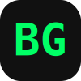

<div align="center">
  
  <h1 align="center">Bisu Ghalan's Portfolio</h1>
  <p align="center">
    <strong>BCS CSNT Student | Ethical Hacker | Kathmandu, Nepal</strong>
    <br />
    <br />
    <a href="https://bisu.com.np">
      
    </a>
    <a href="https://github.com/bisug">
      
    </a>
    <a href="https://www.linkedin.com/in/bisug/">
      
    </a>
  </p>
</div>

---

##  About The Project

This is my personal portfolio website built to showcase my projects, skills, and journey as a **Bachelor of Computer Science — Cyber Security & Network Technology (BCS CSNT)** student based in Kathmandu, Nepal. It serves as a central hub for my technical workflows, automation tools, deployment practices, and networking labs.

> **About BCS CSNT:** An undergraduate program that blends computing fundamentals with specialised knowledge in networking and cybersecurity. It prepares students to design, manage, and secure computer networks, with hands-on experience in ethical hacking, encryption, and system protection. Ideal for careers in IT security, network administration, or cyber defense.

> **AI-Augmented Development:** As a Cybersecurity and Networking student rather than a traditional frontend developer, I built this entire portfolio from scratch by heavily leveraging AI coding assistants. This project serves as a testament to modern problem-solving, rapid prototyping, and the power of AI-augmented workflows.

### Key Features

- **Modern & Responsive Design:** Custom Neo-Brutalist UI with bold contrast, thick borders, and vibrant accents. Typography is powered by **Inter** (sans-serif) and **JetBrains Mono** (monospace).
- **Interactive UI Elements:** Dynamic typewriter effects, smooth scroll progress bar, and interactive glitchy drag-and-drop error pages.
- **SEO Optimized:** Structured data (JSON-LD), localized metadata, `robots.txt`, `sitemap.xml`, and fully semantic HTML.
- **Accessibility:** Keyboard navigable, screen-reader friendly, and respects `prefers-reduced-motion` settings.
- **Performance:** No heavy frameworks -- built with vanilla HTML, CSS, and JS for maximum speed.
- **Security-Minded:** Features standard `/security.txt` vulnerability disclosure file.

---

##  Tech Stack

**Frontend**
<br>


<br>

**Hosting & Deployment**
<br>


<br>

**Tools & Practices**
<br>


---

##  Project Structure

```text
Portfolio-prototype/
├── index.html        # Main portfolio page (Single Page Application structure)
├── 404.html          # Custom 'Page Not Found' error page (interactive drag-and-drop glitch card)
├── 403.html          # Custom 'Forbidden' error page for unauthorized access
├── 500.html          # Custom 'Internal Server Error' page for server faults
├── robots.txt        # Directives for search engine crawlers (SEO)
├── sitemap.xml       # XML Sitemap for better search engine indexing (SEO)
├── humans.txt        # Developer credits and site metadata (for humans to read)
├── .well-known/
│   └── security.txt  # Standardized security vulnerability disclosure policy
└── assets/
    ├── css/          # Stylesheets (modular CSS architecture using @layer)
    ├── js/           # Scripts (scroll logic, typewriter effect, interactivity)
    └── img/          # Images, custom SVG favicon, and background patterns
```

---

##  Local Setup & Development

Want to run this project locally? It's completely static, so no build tools are required.

1. **Clone the repository**
   ```sh
   git clone https://github.com/bisug/My-Portfolio.git
   ```
2. **Navigate to the directory**
   ```sh
   cd My-Portfolio
   ```
3. **Start a local web server** (e.g., using Node.js)
   ```sh
   npx serve .
   ```
4. **Open your browser** and visit `http://localhost:3000`

---

##  Let's Connect

Open to cybersecurity internships, collaborations, or just a quick chat about Python and networking.

<br>

<a href="mailto:bisu.ghlan@gmail.com">
  
</a>
<a href="https://bisu.com.np">
  
</a>

---

<div align="center">
  <p><em>Copyright Bisu Ghalan &copy; 2026. Licensed under the <a href="LICENSE">MIT License</a>.</em></p>
</div>
